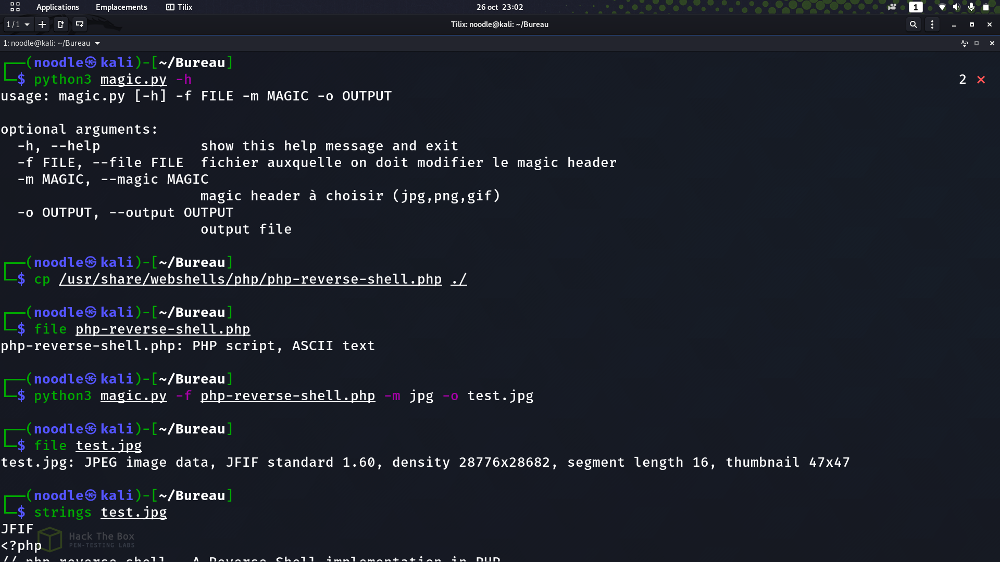

## Wizard.py
Wizard est un programme python permettant de modifier les file signatures d'un fichier
## Usage
```sh
python3 wizard.py [-h] -f <file> -m <jpg,gif,png> -o <output file>
```
## Avec ses arguments désignées:
```
  -h, --help              show this help message and exit
  -f  --file              fichier auxquelle on voudrait modifier le magic number
  -m --magic              désignier le format du fichier de sortie 
  -o --output             désignier le nom du ficihier de sortie 
```

